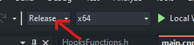
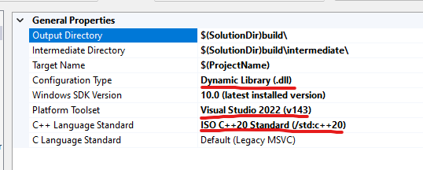
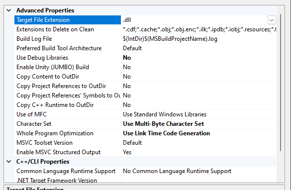

## START THE REPO TO SUPPORT ME ⭐⭐⭐

New Base By Kio For Il2CPP Unity Game Hacking

Youtube Channel: https://www.youtube.com/@kiocode

### Feature already implemented:
- ImGui
- Hooking
- UNIVERSAL ESP
- UNIVERSAL ESP CHARM
- UNIVERSAL Box ESP
- SEMIUNIVERSAL Skeleton ESP
- Basic UNIVERSAL Aimbot (also with FOV)
- Basic Inspector Components
- Mouse Force Drawer
- Camera FOV Changer
- Crossair Drawer

## Installation
1) Clone the repo with `git clone https://github.com/k-i-o/IL2CPPBaseByKio`
2) If you doesn't need Lua, just remove:
   1. The luaaa.hpp inside Libraries
   2. Delete the function DrawLuaEditor inside Core > Utils.h
   3. Remove `#include <lua.hpp>` from Core > Variables.h and delete the namespace called Lua
   4. In the main.cpp:
      - Remove `#include <Libraries/luaaa.hpp>`
      - Remove `using namespace luaaa;`
      - Remove `if (Lua::LuaState != NULL)` and the content
      - Remove `void bindToLUA(lua_State* L)` inside the function `HandleInputs`
      - Remove `Lua::LuaState = luaL_newstate(); luaL_openlibs(Lua::LuaState);	bindToLUA(Lua::LuaState);` inside `Setup`.
   OR YOU CAN JUST DOWNLOAD VCPKG FOLLOWING JUST THE FIRST STEP OF THIS GUID [HERE](https://learn.microsoft.com/en-us/vcpkg/get_started/get-started-msbuild?pivots=shell-cmd#1---set-up-vcpkg) and writing in the cmd `set VCPKG_ROOT="C:\path\to\vcpkg"` and `set PATH=%VCPKG_ROOT%;%PATH%` (restart Visual Studio)

## Usage

BEFORE BUILD MAKE SURE OF THESE VISUAL STUDIO CONFIG

### BUILD MODE: RELEASE

### PROJECT PROPERTIES: 
- Configuration type: DLL
- Platform Toolset: Your latest (v143 VS2022 suggested)
- C++ Language Standard: ISO C++ 20 Standard

### PROJECT ADVANCED PROPERTIES:

## Credits
SneakyEvil For The Resolver - https://github.com/sneakyevil/IL2CPP_Resolver &

RDBO For His ImGui DX11 Hook - https://github.com/rdbo/ImGui-DirectX-11-Kiero-Hook &

Idol For His First Base - https://github.com/IdolTheDev/Il2CPP-Base
